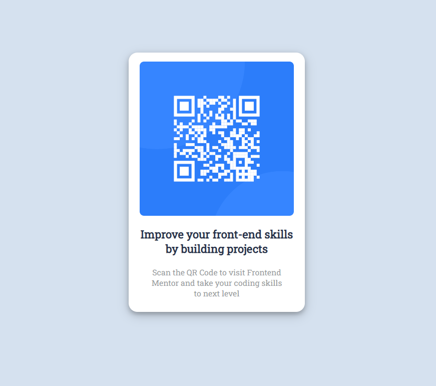

# Frontend Mentor - QR code component solution

This is a solution to the [QR code component challenge on Frontend Mentor](https://www.frontendmentor.io/challenges/qr-code-component-iux_sIO_H). Frontend Mentor challenges help you improve your coding skills by building realistic projects. 

## Table of contents

- [Overview](#overview)
  - [Screenshot](#screenshot)
  - [Links](#links)
- [My process](#my-process)
  - [Built with](#built-with)
  - [What I learned](#what-i-learned)
  - [Continued development](#continued-development)
  - [Useful resources](#useful-resources)
- [Author](#author)
- [Acknowledgments](#acknowledgments)


## Overview

### Screenshot




### Links

- Solution URL: [Here](https://github.com/wagaskon/qr-code-frontenddev)
- Live Site URL: [Here](https://wagaskon.github.io/qr-code-frontenddev/)

## My process

### Built with

- Semantic HTML5 markup
- CSS custom properties
- Flexbox


### What I learned

The famouse quote: How to center a div. Today I learned that. Beside centering div, I also learned how to use em and rem units of css instead of px.

Code Snippets;


```css
body{
    background: #D5E1EF;
    display: flex;
    justify-content: center;
    align-items: center;
    font-family: 'Roboto Slab', serif;
 }
.container{  
    margin-top: 10em;
    width: 19em;
    text-align: center;
    background-color: #FFFFFF;
    padding: 0.5em;
    border-radius: 1em;
    box-shadow: 0 4px 8px 0 rgba(0, 0, 0, 0.2), 0 6px 20px 0 rgba(0, 0, 0, 0.19);
}
```

### Continued development

I am looking for learning flexbox in more proper way and also keen to learn Grid. Also I want to start building projects with React Js in comming days.


### Useful resources

- [CSS from W3School](https://www.w3schools.com/css/default.asp) - The W3School always help me in writing CSS. I recommend this if you are not feeling confident in css, you should definently stick with this site.


## Author

- Website - [Waqas khan](https://github.com/wagaskon)
- Frontend Mentor - [@wagaskon](https://www.frontendmentor.io/profile/wagaskon)
- Twitter - [@wagaskon](https://twitter.com/wagaskon)


## Acknowledgments

If you are stuck in Tutorial Hell like me, that totally normal, but I my advice will to totally stop watching tutorial for sometime, I know to have enough skills to start. Start anywhere and make something. 
